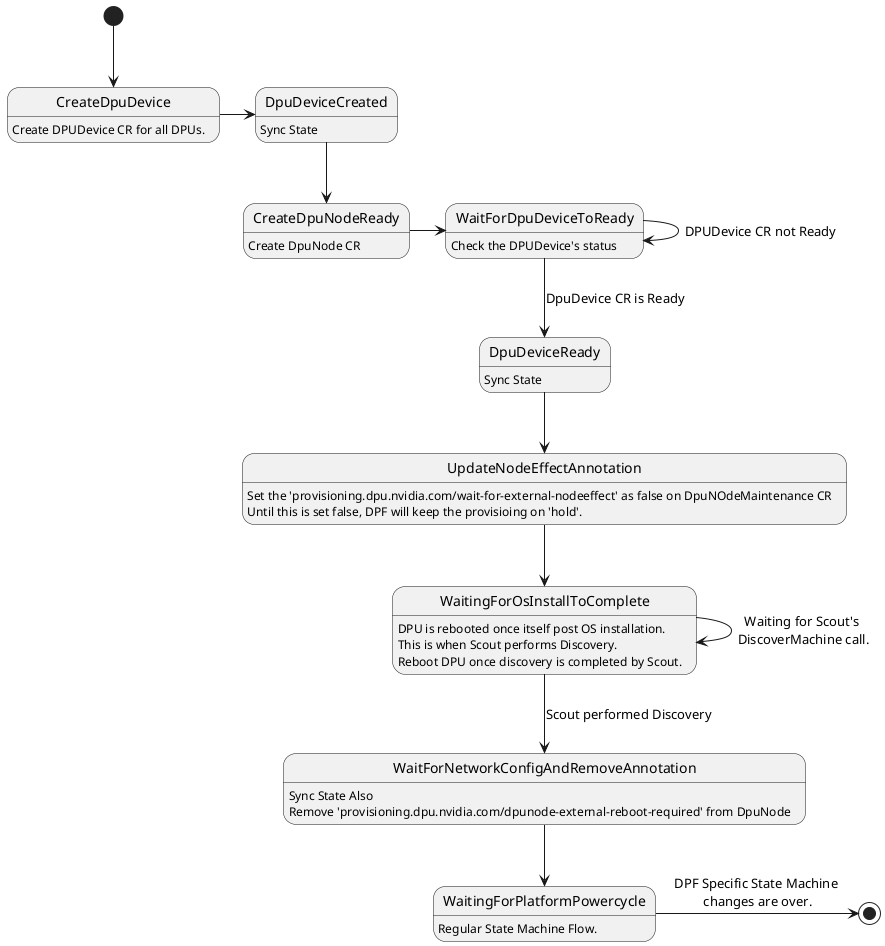
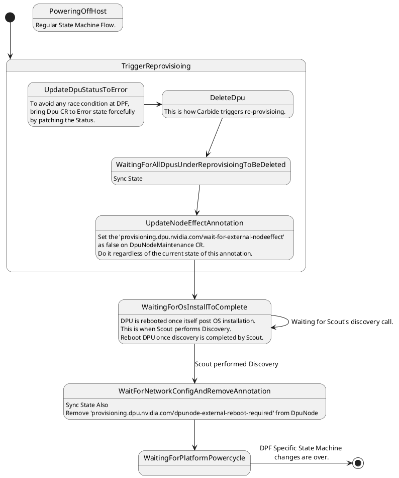
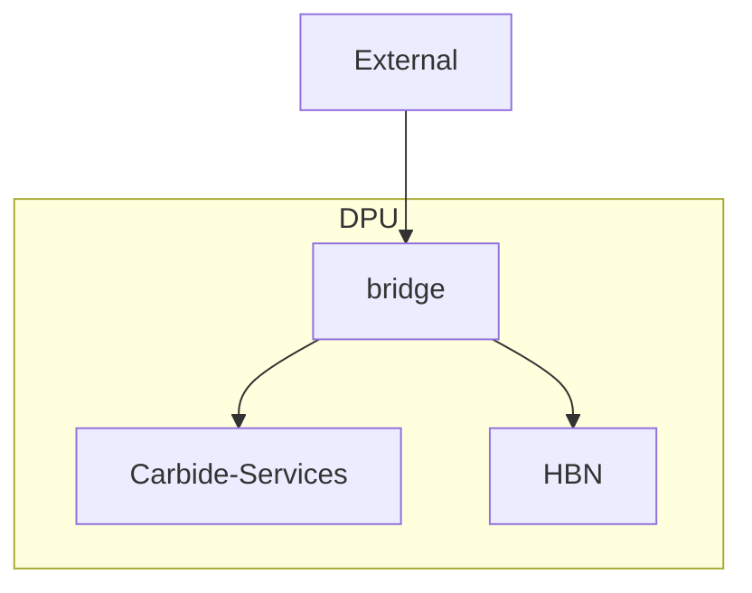

- Feature Name: (name of the feature that's a valid URL - e.g. new-forge-feature)
- Design Start: 01-Dec-2025
- Design (Pull Request URL: URL to this PR - update after submitting)
- Issue Location: (link to where we're tracking implementation work)

- PIC: Abhishek Varshney

Contributors:

- Any additional contributors, if any.

# Summary

[summary]: #summary

[DPF](https://docs.nvidia.com/networking/display/dpf2507) is a framework for provisioning DPUs and orchestrating kubernetes services within the kubelet on the DPU.
This document describes the initial implementation phase of integrating DPF into Carbide for provisioning and details the phases of the next sets of work to
fully integrate service orchestration through the DPF framework. DPF will replace the existing PXE based workflow that is default to Carbide for BF3 and leave BF2 alone.

The goal of DPF is to allow users the freedom of operating a DPU without having to know about the lifecycle mechanics of installation, firmware updates and service installation.
It will allow the Carbide team to focus on the Carbide workflow while letting DPF control the lifecycle of the DPU. Many of the issues that Carbide has seen with DPU installation
can be better handled by the team that is building DPF, who is closely aligned with the DPU architects. The state machine for Carbide has become quite messy with workarounds
due to the DPU installation, and integration of DPF will remove many of those workarounds for BF3. The goal of DPF integration is to make the DPU an implementation detail behind the DPF
framework, and something that Carbide does not directly interact with.

# How are you implementing?

[implementation]: #implementation

Implementation of DPF will be done in phases. Each phase will be an independent milestone that can be deployed to production.
Each milestone will require a force delete in order to migrate to the next milestone, but a deployment should be able to handle
a mixed set of milestones as they should be functionally equivalent to the existing machines with more DPF concepts implemented.
The goal at the end of the milestones is to use an upstream signed BFB with all the needs of Carbide served by DPF services and to be
at feature parity with the existing installation.

*Note:* In order to add a new milestone without disrupting services and allow for force deletes to use the new milestone code, it is
recommended to version the names of the CRDs we create.

```
Milestone 1: DPU provisioning with forge specific BFB
Milestone 2: kubernetes integration and DTS service deployment
Milestone 3: Service Deployment
Milestone 4: OTEL Service deployment
```
# Milestone 1 - DPU Provisioning

DPF does not operate on all existing Carbide managed hardware. This design will assume that the existing framework for installation and
management of the DPU will be maintained alongside the new framework using DPF. The decision for whether to use DPF will be an internal
implementation detail and will be enabled for all deployments that run BF3s. The earliest version that can be initially ingested into
DPF is [DOCA 2.5](https://gitlab-master.nvidia.com/doca-platform-foundation/doca-platform-foundation/-/blob/e57d73ecae6b676925807c431d049772ecf580ed/docs/public/user-guides/zero-trust/prerequisites/system.md)
so every existing Carbide deployment with BF3 will be required to use DPF. This milestone and the subsequent milestones  will need to
ensure the existing BF2 deployment is still functional.

For Milestone 1, the DPU will be provisioned by DPF and all other interaction will function the same as it does in the PXE boot scenario.
Carbide has opted to not use the discovery provided by DPF, as Carbide will be doing the discovery and preprovisioning. The [following document](https://docs.nvidia.com/networking/display/dpf2507/zero+trust+advanced+configuration#src-4224767888_ZeroTrustAdvancedConfiguration-ManualDPUResourceCreation)
describes how to manually discover a DPU in DPF. At a high level, this is what the first Milestone will cover.

## Assumptions for Milestone 1
 - redfish installation and its states will be removed. DPF uses Redfish for installation and the redfish installation never made it to production [INSERT JIRA HERE for removal code]()
 - substates that no longer are used will also be removed
 - Preprovisioning will not change and a Managed Host will be linked in the same way
 - Milestone 1 CRDs will need to have a label such as `-m1` added to them, so subsequent milestones can operate independently

## Custom bf.cfg
For Milestone 1 Carbide will be inserting a `BF_CFG_TEMPLATE` with the custom template file that Carbide already uses. The template was recently broken
into a few pieces to facilitate the redfish installation approach, and this broken up template is how Carbide will serve the contents.
Please refer to the [installation scripts that generate the bf.cfg](https://gitlab-master.nvidia.com/nvmetal/carbide/-/blob/d7049baf51ccc0975fd0f4605142f5d7b084d37c/pxe/Makefile.toml?page=2#L1074-1087)
for more information on how it will look when it is fully rendered.

The only addition to the existing script is the [cluster formation code](https://gitlab-master.nvidia.com/doca-platform-foundation/doca-platform-foundation/-/blob/ed23351abc933258c8c6c141b69e6468bde67426/internal/provisioning/controllers/dpu/bfcfg/bf.cfg.template#L215-288).
While this code is not used in directly in milestone 1, it is a good idea to have it. If it is found that this is causing failures because
of kubernetes things not being fully installed, it can be removed or set to not fail. This is pulled directly from the existing
bf.cfg template in DPF, and is how DPF does the cluster joins by default. This will be removed once we stop sourcing a custom
`BF_CFG_TEMPLATE` and use the upstream DPF template.

To install the `BF_CFG_TEMPLATE`, please refer to the `Custom bf.cfg` [user docs](https://docs.nvidia.com/networking/display/doca-platform-framework-dpf-documentation-v25-4.4.pdf).
At present the `BF_CFG_TEMPLATE` is required to be in a config map defined before its use in the subsequent CRDs.

**Since carbide is going to use single bf.cfg for all DPUs, carbide can't pass machine specific information like machine_interface_id and hostname.**

## Custom forge.bfb
For milestone 1, Carbide will continue to use the custom bfb image that is created at build time. This image is currently
exported as only an efi/rootfs for PXE, but can easily be rebuilt using the same tools that are used to exploded the archive.


## Kubernetes changes for Milestone 1

Below is an example script demonstrating how to install version 25.10.1 and create the necessary CRDs.
 - a secret must be created for all DPU BMCs in the DPF namespace -
 - a PVC for the BFBs must exist on the cluster. This PVC needs to be available to any host that runs the DPF CRDs. The current default DPF implementation is to
use an NFS backed PVC, but this document does not specify the implementation details of the PVC.
 - the BFB that will be used in DPF needs to be added to the PVC. DPF will have a minimum version that we have to use based on the timing of the install.
 - an IP that is accessible by the DPUs that resolves to the [BFB Registry created by DPF](https://catalog.ngc.nvidia.com/orgs/nvidia/teams/doca/containers/bfb-registry?version=v25.7.1)
 - the custom BFB config template from the previous section has been created and exists in a config map
 - the DPF CRDs and prerequisite should be installed. The entire stack of DPF does not need to be installed for milestone 1.

Below is an example of the CRDs that are deployed in the development environment for Milestone 1. This script and the associated CRDs can be used as a reference for installing DPF in other environments.


### Installation script
```bash
dpf:
  #!/usr/bin/env bash
  set -eE -o pipefail # Exit immediately if a command or subshell exits with a non-zero status
  if [ -n "${DEBUG_JUST}" ] ; then  set -xv; fi

  mkdir /tmp/bfb || true
  doas chmod 777 /tmp/bfb
  
  cat ${REPO_ROOT}/envs/${ENVIRONMENT_PATH}/dpf/objects/cert-manager-config/policy.yaml | kubectl --context $KUBECTL_CONTEXT apply -f-
  cat ${REPO_ROOT}/envs/${ENVIRONMENT_PATH}/dpf/objects/cert-manager-config/rbac-role.yaml | kubectl --context $KUBECTL_CONTEXT apply -f-

  echo "****Installing DPF prerequistites****"
  docker run --rm --net=host -v "${HOME}/.kube:/helm/.kube" -v "${HOME}/.config/helm:/helm/.config/helm" -v "${PWD}:/wd" --workdir /wd ghcr.io/helmfile/helmfile:v0.156.0 helmfile --file ./envs/${ENVIRONMENT_PATH}/dpf/prerquisite/helmfiles/prereqs.yaml sync

  echo "****Deploying the DPF operator****"
  REGISTRY="https://helm.ngc.nvidia.com/nvidia/doca"
  TAG="v25.10.1"
  helm repo add --force-update dpf-repository ${REGISTRY}
  helm repo update
  helm upgrade --install -n dpf-operator-system dpf-operator dpf-repository/dpf-operator --version=$TAG

  ## Ensure all pods in the DPF Operator system are ready.
  kubectl wait --for=condition=ready --namespace dpf-operator-system pods --all

  echo "****Applying cluster-binding to allow carbide-api to access all namespaces****"
  kubectl --context $KUBECTL_CONTEXT apply -f ${REPO_ROOT}/envs/${ENVIRONMENT_PATH}/dpf/objects/cluster-binding.yaml

  echo "****Creating objects to use existing storage by dpf****"
  kubectl --context $KUBECTL_CONTEXT apply -f ${REPO_ROOT}/envs/${ENVIRONMENT_PATH}/dpf/objects/storage/storage.yaml

  echo "****Applying dpu-operator-config and dpu-cluster****"
  kubectl --context $KUBECTL_CONTEXT apply -f ${REPO_ROOT}/envs/${ENVIRONMENT_PATH}/dpf/objects/generated/dpu-operator-config.yaml
```

### Prerequisites
To install DPF, certain prerequisites are required, some of which are already provided by Carbide. Because of this, not all prerequisites can be installed exactly as described in the standard DPF documentation. Additional prerequisite files, distinct from those installed by Carbide, can be found in the `forged/envs/local-dev/dpf/prerequisite` directory along with the associated values. For further details, refer to [this merge request](https://gitlab-master.nvidia.com/nvmetal/forged/-/merge_requests/4724).

### CRDs mentioned in above script (Static)
The following CRDs are static resources that should be created during environment bootstrapping using `forged`. Some are required to allow `dpf` to leverage existing prerequisite components already installed in the environment.

#### cluster-binding.yaml
User carbide-api does not have permission to access `dpf-operator-system`. Following cluster-role-binding gives `admin` access to `carbide-admin` user. 
Note: This is ok for **dev-env**, but production env might need better way to do it.

```yaml
---
apiVersion: rbac.authorization.k8s.io/v1
kind: ClusterRoleBinding
metadata:
  name: carbide-api-global-admin-binding
roleRef:
  apiGroup: rbac.authorization.k8s.io
  kind: ClusterRole
  name: cluster-admin
subjects:
- kind: ServiceAccount
  name: carbide-api
  namespace: forge-system
```

#### cert-manager
These changes are needed so that `dpf` can use `cert-manager` installed by `Carbide`.
The certificate policy must be configured with strict rules in production env to ensure that it does not allow access to certificates used/issued by Carbide.

##### policy.yaml
```yaml
apiVersion: policy.cert-manager.io/v1alpha1
kind: CertificateRequestPolicy
metadata:
  labels:
    argocd.argoproj.io/instance: dpf-pki-policies
  name: dpf-approval-policy
spec:
  # Any CertificateRequest matching these selectors is evaluated for approval
  selector:
    namespace:
      matchNames: ["dpf-operator-system"]
    issuerRef:
      name: "dpf-provisioning*"
      kind: "*"
      group: "*"

  # Define what is allowed. Use "*" for "allow all" within this namespace.
  allowed:
    commonName:
      value: "*"
    dnsNames:
      values: ["*"]
    ipAddresses:
      values: ["*"]
    uris:
      values: ["*"]
    emailAddresses:
      values: ["*"]
    isCA: true
    usages:
      - "server auth"
      - "client auth"
      - "digital signature"
      - "key encipherment"
```

##### rbac_role.yaml
```yaml
apiVersion: rbac.authorization.k8s.io/v1
kind: ClusterRole
metadata:
  name: cert-manager-policy:dpf-approval-policy
rules:
  - apiGroups: ["policy.cert-manager.io"]
    resources: ["certificaterequestpolicies"]
    verbs: ["use"]
    resourceNames: ["dpf-approval-policy"]
---
apiVersion: rbac.authorization.k8s.io/v1
kind: ClusterRoleBinding
metadata:
  name: cert-manager-policy:dpf-approval-policy
roleRef:
  apiGroup: rbac.authorization.k8s.io
  kind: ClusterRole
  name: cert-manager-policy:dpf-approval-policy
subjects:
  - kind: ServiceAccount
    name: cert-manager
    namespace: cert-manager
```

#### Storage

```yaml
---
apiVersion: v1
kind: PersistentVolume
metadata:
  name: bfb-pv
spec:
  capacity:
    storage: 10Gi
  volumeMode: Filesystem
  storageClassName: "local-path"
  accessModes:
    - ReadWriteMany
  hostPath:
    path: /tmp/bfb  ## Some path on controller node
  persistentVolumeReclaimPolicy: Delete
---
apiVersion: v1
kind: PersistentVolumeClaim
metadata:
  name: bfb-pvc
  namespace: dpf-operator-system
spec:
  storageClassName: "local-path"
  accessModes:
  - ReadWriteMany
  resources:
    requests:
      storage: 10Gi
  volumeMode: Filesystem
```

#### dpu_operator_config
```yaml
---
apiVersion: operator.dpu.nvidia.com/v1alpha1
kind: DPFOperatorConfig
metadata:
  name: dpfoperatorconfig
  namespace: dpf-operator-system
spec:
  dpuDetector:
    disable: true
  provisioningController:
    bfbPVCName: "bfb-pvc"
    bfCFGTemplateConfigMap: "carbide-dpf-bf-cfg-template"
    dmsTimeout: 900
    installInterface:
      installViaRedfish:
        bfbRegistryAddress: 10.217.98.15:10090
        bfbRegistry:
          port: 10090
        skipDPUNodeDiscovery: true
  kamajiClusterManager:
    disable: false
  networking:
    highSpeedMTU: 9000
```

#### dpu-cluster.yaml

```yaml
---
apiVersion: provisioning.dpu.nvidia.com/v1alpha1
kind: DPUCluster
metadata:
  name: carbide-dpf-cluster
  namespace: dpf-operator-system
spec:
  type: kamaji
  clusterEndpoint:
    # deploy keepalived instances on the nodes that match the given nodeSelector.
    keepalived:
      # interface on which keepalived will listen. Should be the oob interface of the control plane node.
      # This is the interface name where controller IP is assigned on the controller node.
      interface: enp181s0np0
      # Virtual IP reserved for the DPU Cluster load balancer. Must not be allocatable by DHCP.
      vip: 10.217.116.254
      # virtualRouterID must be in range [1,255], make sure the given virtualRouterID does not duplicate with any existing keepalived process running on the host
      virtualRouterID: 126
      nodeSelector:
        node-role.kubernetes.io/control-plane: "true"
```

#### app-projects/dpu.yaml

```yaml
---
apiVersion: argoproj.io/v1alpha1
kind: AppProject
metadata:
  generation: 2
  name: doca-platform-project-dpu
  namespace: argocd
  resourceVersion: "7668031"
  uid: fb8f0653-614c-456c-b79d-26e5e3ed6751
spec:
  clusterResourceWhitelist:
  - group: '*'
    kind: '*'
  description: Installing DPU Services
  destinations:
  - name: carbide-dpf-cluster
    namespace: '*'
  orphanedResources: {}
  sourceNamespaces:
  - dpf-operator-system
  sourceRepos:
  - '*'
```

#### app-projects/host.yaml

```yaml
---
apiVersion: argoproj.io/v1alpha1
kind: AppProject
metadata:
  name: doca-platform-project-host
  namespace: argocd
  resourceVersion: "7668032"
  uid: 3ee21a62-a1e5-429e-aa08-4c62335127fb
spec:
  clusterResourceWhitelist:
  - group: '*'
    kind: '*'
  description: Installing DPU Services
  destinations:
  - name: in-cluster
    namespace: '*'
  orphanedResources: {}
  sourceNamespaces:
  - dpf-operator-system
  sourceRepos:
  - '*'
```

### Creation of other CRDs by code
Each time Carbide starts, it should verify whether the required CRDs exist. Certain CRDs, such as the BFB, need to be recreated on every startup to ensure the latest BFB content is copied into persistent storage. The following example is provided in `yaml`, but should be implemented in Rust code that creates (or updates) these resources at runtime.

#### BFB
The Carbide `API` is responsible for ensuring the BFB CRD exists and points to the latest BFB bundle in persistent storage. On each startup, the API should create or update the BFB CRD and actively watch its status for completion. 

```yaml
apiVersion: provisioning.dpu.nvidia.com/v1alpha1
kind: BFB
metadata:
  name: bf-bundle
  namespace: dpf-operator-system
spec:
  url: "http://carbide-pxe.forge/public/blobs/internal/aarch64/forge.bfb"
```

API should monitor the BFB status. The expected status is
```yaml
status:
    conditions:
    - lastTransitionTime: "xxxxxxxxxxxx"
      message: ""
      reason: Success
      status: "True"
      type: Ready
    phase: Ready
```
As soon as above status is observed, move to next CRD.

If `phase` indicates `Error`, this might mean `pxe` service is still not up. In this case, wait for 30 seconds, delete and recreate `bfb` object. This process can be retried for 5 times.

#### dpu_flavor.yaml
It is the simplest implementation of DPUFlavor used for milestone 1.
```yaml
---
apiVersion: provisioning.dpu.nvidia.com/v1alpha1
kind: DPUFlavor
metadata:
  name: carbide-dpu-flavor
  namespace: dpf-operator-system
spec:
  dpuMode: zero-trust
```

#### dpu_set.yaml
The DPUSet determines which managed hosts, Carbide is allowed to provision. Only DPUNodes that have the label `carbide.controlled.node: "true"` will be eligible for provisioning by `dpf`.

```yaml
kind: DPUSet
metadata:
  name: carbide-dpu-set
  namespace: dpf-operator-system
spec:
  dpuNodeSelector:
    matchLabels:
      carbide.controlled.node: "true"
  dpuTemplate:
    spec:
      bfb: 
        name: "bf-bundle"
      dpuFlavor: "carbide-dpu-flavor"
      nodeEffect:
        applyOnLabelChange: false
        hold: true
        force: false
  strategy: 
    type: "OnDelete"
```

#### bf-cfg-template-config-map
Carbide-api should read bf.cfg at compile time. During startup, api should extrapolate the template with required variables and create the following ConfigMap.
Apart from 

```yaml
apiVersion: v1

immutable: false
kind: ConfigMap
metadata:
  name: forge-bf-cfg-template
  namespace: dpf-operator-system
data:
  BF_CFG_TEMPLATE: "\nbf-cfg-data\n\n"
```

The template must also include the following configuration to ensure that cloud-init is forced to use NoCloud as the datasource, preventing it from attempting other initialization methods:

```bash
tee /var/lib/cloud/seed/nocloud-net/meta-data <<EOF
instance-id: nocloud
EOF

tee /etc/cloud/cloud.cfg.d/99-force-nocloud.cfg <<EOF
datasource_list: [ NoCloud ]
EOF
```

Note: Updating forge-bf-cfg-template does not require a restart or redeployment of the `dpf-operator-config` resource and the changes will be available from next (re)provision. This is confirmed with dpf team.

## Carbide changes (Rust)
Once all above configurations are applied, following changes will come into picture.

### Feature Enable/Disable control
The feature can be enabled or disabled globally for the site through the `CarbideConfig` setting in the `carbide-api-site-config.toml` file located in the `forged` repository.
```toml
[dpf]
enabled = false
```

The feature can also be enabled or disabled for individual managed hosts. An admin-cli command will be available to configure this setting for a specific host.
```bash
admin-cli dpf enable/disable <host-id>
admin-cli dpf show host <host-id>
admin-cli dpf show all
```

### admin-cli command to validate the infrastructure 
A admin-cli command can be added to verify the all CRs status to detect any possible issue with dpf infrastructures readiness.
```bash
admin-cli dpf validate
```

### Scout changes
Previously, Scout included the `machine_interface_id` in the discover_machine request, with the id assigned via `/etc/forge/config.toml` and referenced during the `bf.cfg` processing. Since Carbide will now use a single, common `bf.cfg` for all DPUs, the `interface_id` can no longer be provided in the discover_machine request. As a result, `interface_id` must be removed from `bf.cfg`, and the `discover_machine` operation should instead rely solely on the `remote_ip` for identification.

### PXE (API) Changes
API shall send `exit` as only instruction to DPUs if `dpf` is enabled.

### State machine changes

#### Initial Ingestion State Diagram


#### Reprovisioning State Diagram


### CR Monitor
Because CRs are orchestrated by Kubernetes, their state can be modified externally e.g., triggering manual provisioning actions, or changing BMC IP of a DPUDevice outside of Carbide. To guard against configuration drift or unintended changes, Carbide should implement a monitoring service that continuously checks the state of relevant CRs against the expected configuration. If the monitor detects any mismatch or unauthorized modification, it should promptly flag the corresponding machine as unhealthy to alert operators and ensure overall system integrity.

### Force Deleting the DPU

During force delete the resources that govern the DPU should also be deleted. Remove the `DPUNode` and the `DPUDevice` for the given
DPU that is being force deleted. This will remove any data within DPF about that DPU (or set of DPUs in a multi DPU scenario) and
allow for Carbide's automation to reprovision the machine the same way it does today. This is more than simply removing the
`DPU` CRD that we did in the reprovisioning section. This will ensure DPF does not try to reinstall the DPU until Carbide
re-adds those CRDs during installation.

## QA
[Milestone 1 qa]: ##qa

The end to end cycle of provisioning will test this feature. The CRDs can be validated if need be, but are internal implementation
details of the milestone and will change over time.

The definition of done is that BF3s and BF2s can both still be both provisioned and reprovisioned from a good state will be
enough to ensure milestone 1 is complete.

## Operational Changes / Concerns
[Milestone 1 operations]: #operations

The CRDs/Operators will need to be installed. Please refer to [this guide](https://docs.nvidia.com/networking/display/dpf2507/dpf+prerequisites+for+zero+trust)
for what is needed. Milestone 1 should have no difference in operation other than the initial installation of the CRDs and operators.

# Milestone 2 - kubernetes integration and DTS service deployment

Milestone 2 is the first milestone to integrate the kubernetes cluster, or `DPUCluster`. The [helm prerequisites](https://docs.nvidia.com/networking/display/dpf2507/helm+prerequisites)
also need to be set up for Milestone 2. Milestone 2 does not attempt to add all the DPU Services, as those can be done piece by piece.

## Assumptions for Milestone 2
- kamaji is used as the cluster manager, and is set up to run in the same control plane as the existing containers
- the custom forge BFB is still being used
- force delete must happen to move a DPU From milestone 1 to milestone 2
- Milestone 2 CRDs will need to have a label such as `-M2` added to them, so existing and subsequent milestones can operate independently

## Kubernetes changes for Milestone 2

Milestone 2 contains many changes to the existing deployment model for DPF. This is where the concepts of a DPU Cluster are introduced
and handling of some services will be installed via DPF. For milestone 2, the smallest footprint service is chosen for installation.
This is to ensure the engineering team understands how DPF works end to end and can focus on only the kubernetes and kamaji parts
with minimal worry of adding large changes to the milestone.

*Note:* as of this writing, DPF has a hard limit on 1 1000 node kubernetes cluster. Subsequent versions of DPF will require
more than one `DPUCluster` to be created in the event the DPU installation is larger than 1000 nodes. The handling of what
cluster a node joins will be handled with selectors, much in the same way a DPU Device and a DPU Service selectors are handled.
If the selector is the same between the two clusters, once the first cluster is filled, the second cluster will be used.

[This document](https://docs.nvidia.com/networking/display/dpf2504/dpucluster#src-3914579352_DPUCluster-UsingtheKamajiclustermanager)
details the kamaji cluster manager. The following is an example of what it could look like in production, but may change with
security and real world values being applied. Kamaji will be installed on the same physical nodes as the control plane cluster.

```---
apiVersion: provisioning.dpu.nvidia.com/v1alpha1
kind: DPUCluster
metadata:
  name: dpu-cluster-m2
  namespace: dpf-operator-system
spec:
  ## type signals which controller implementation should take responsibility for the DPUCluster.
  type: kamaji
  ## Max nodes is the maximum number of nodes supported by the DPUCluster implementation.
  # maxNodes: 1000 is the default value
  ## Version is the version of the Kubernetes control plane.
  version: v1.30.2
  ## Cluster endpoint is supplied by the user and provides and IP and other details to make the APIServer available.
  clusterEndpoint:
    # deploy keepalived instances on the nodes that match the given nodeSelector.
    keepalived:
      # interface on which keepalived will listen. Should be the oob interface of the control plane node.
      interface: interface_one
      # vip is the Virtual IP reserved for the DPU Cluster load balancer. Must not be allocatable by DHCP.
      vip: dpucluster_vip
      # virtualRouterID must be in range [1,255], make sure the given virtualRouterID does not duplicate with any existing keepalived process running on the host
      virtualRouterID: 126
      # nodeSelector selects which nodes the keepalived pods will be scheduled to.
      nodeSelector:
        node-role.kubernetes.io/control-plane: ""
```

### Doca Telemetry Service CRDs

In order to install DTS on every DPU, a few CRDs need to be created. First the `DPUServiceConfiguration` needs to be defined for DTS.

```---
apiVersion: svc.dpu.nvidia.com/v1alpha1
kind: DPUServiceConfiguration
metadata:
  name: dts-m2
  namespace: dpf-operator-system
spec:
  deploymentServiceName: "dts-m2"
  serviceConfiguration:
    configPorts:
      serviceType: None
      ports:
        - name: httpserverport
          protocol: TCP
          port: 9100
```
Followed by the `DPUServiceTemplate`, which defines the helm chart information. As of the time of this writing [the version for DTS is 1.22.1](https://catalog.ngc.nvidia.com/orgs/nvidia/teams/doca/helm-charts/doca-telemetry?version=1.22.1)

```---
apiVersion: svc.dpu.nvidia.com/v1alpha1
kind: DPUServiceTemplate
metadata:
  name: dts-m2
  namespace: dpf-operator-system
spec:
  deploymentServiceName: "dts-m2"
  helmChart:
    source:
      repoURL: $HELM_REGISTRY_REPO_URL
      version: $VERSION
      chart: doca-telemetry
    values:
      exposedPorts:
        ports:
          httpserverport: true
```

A `DPUFlavor` and `BFB` need to also be created to support Milestone 2, and they will not differ from Milestone 1 other than the name
of the CRD. Ensure the additional bits of the DPUFlavor custom bf.cfg match what is in the bf.cfg.template in the upstream repo
to ensure that the cluster joining process behaves properly.

The final piece to ensure DPUs are deployed with DTS is to create a `DPUDeployment`. This ties the pieces together and allows
for DPUs to have the DTS service on them once they are discovered.

```---
apiVersion: svc.dpu.nvidia.com/v1alpha1
kind: DPUDeployment
metadata:
  name: dts-enabled-service-m2
  namespace: admin-namespace-m2
spec:
  dpus:
    bfb: BFB-m2
    flavor: Flavor-m2
    dpuSets:
    - nameSuffix: "-m2"
      nodeSelector:
        matchLabels:
          feature.node.kubernetes.io/dpu-enabled: "true"
      dpuSelector:
        provisioning.dpu.nvidia.com/dpudevice-pf0-name: p0
  services:
    dts-m2:
      serviceTemplate: dts-m2
      serviceConfiguration: dts-m2
```

Once these are defined, a new `DPUDevice` and `DPUNode` that is created for each DPU that meets the `nameSuffix` selector.
In order for the DPUNode to have its DPU's ingested properly, the name must reflect `name: ${DPU_NODE_NAME_FROM_RUNTIME}-m2`, as
the node selector in the service will be looking for things named `-m2`.

## State machine changes

There will be no state machine changes as this does not alter the state of the machine in any way. The CRDs used will be updated
to reflect the Milestone 2 label selector `-m2` and the existing CRDs can be deleted once there are no more DPUs using them.

## Other code changes

Currently, DTS is installed in the carbide custom bf.cfg. [This line](https://gitlab-master.nvidia.com/nvmetal/carbide/-/blob/trunk/pxe/templates/user-data#L198)
should be removed in the `BF_CFG_TEMPLATE` that is used for Milestone 2. Ensure that this is not also deleted from the existing user-data
file because existing codebases and legacy installs need this to still run on provisioning.

## QA

Just like Milestone 1, Milestone 2 requires a machine to be discovered. This discovery process should ensure the DTS service is running
on the cluster as it exists today in deployments.

A set of CRDs will be created on the namespace defined in the `DPUDeployment`. There should be a `dpuset` and `dpuservice` at the
very least and those can be validated from the kamaji cluster.

# Milestone 3 - Service Deployment

Initially this design attempted to transform the minimal number of services within each milestone. This proved problematic because
each service has a dependency on HBN, and that dependency is not easy to manage with only one portion of the system converted.
This milestone will contain two `DPUService` CRDs, one for HBN and one for the DPU Services that Carbide exposes. The carbide
services like DHCP and IMDS both rely on the DPU agent to write configs, so these will reside with the DPU until such a time
where they no longer rely on local file writes to modify their config.

## Per DPU config edits and DPF

DPF has a concept of `perDPUValues`. While this sounds like something Carbide should use, what it does is store a global config
map, and anytime the `perDPUValues` map is updated, it restarts all `Service`'s running backed by that map. This means that changing
a single config value in HBN in that would end up restarting every HBN on every DPU. Carbide and DPF will be working together
in the coming months to better the story around values that differ per instance of a service deployment. Once this is implementedq
in DPF, the big container that contains all of the DPU `Service`'s can be broken up into many `Service` charts and each one
can be updated from Carbide instead of the agent on a particular DPU.

## High level design for Milestone 3 using SFC

This milestone introduces SFC, which is a logical L2 learning switch that is configured by values within DPF. It is quite extensible,
but for M3, it will be used to route DHCP traffic to the DHCP server. The DPU will be configured to allow both the DHCP server and HBN
to receive broadcast traffic using SFC. Since HBN will not know how to handle this traffic, it will drop it. The DHCP server
will respond accordingly with what it knows. For unicast traffic like DHCP renews and IMDS traffic, HBN will need to be configured
to have a link-local IP on the same subnet as the DHCP server and it will be able to route traffic over the SF back to the DHCP server.
The unicast traffic scenario is already done today in the Carbide HBN configuration. This link-local addressing will also apply
to how the DPU agent will communicate to HBN to update the nvue config.



## Services built by Carbide

All things running in DPF will eventually become `DPFService` containers. These containers need to be built and stored somewhere.
As nvcr.io is the location for the official builds, Carbide will need to start publishing to nvcr.io for releases. This needs
to be built into the CI workflow such that every release sends all containers to nvcr.io. This also implies that old containers
will need to be cleaned up over time, once they are no longer in use. A local repository should be created for the dev environments
such that local builds do not need to be sent to nvcr.io. This should be run within in the kubernetes cluster and export a routable
IP. DPF will use this local registry to pull its containers through in the case of a dev environment.

Services will be packaged via `Helm` and supplied to a `DPUService`. An example of what the DHCP server could look like is below.
Real time config editing for the carbide services container will be done by the DPU agent, which is one of the services bundled
within the services container.

```
---
apiVersion: svc.dpu.nvidia.com/v1alpha1
kind: DPUService
metadata:
  name: carbide-services-m3
  namespace: dpf-operator-system
spec:
  serviceID: carbide-services-m3
  helmChart:
    source:
      repoURL: https://helm.ngc.nvidia.com/nvidia/carbide
      version: 1.0.0
      chart: carbide-services
    values:
      image:
      repository: nvcr.io/nvidia/carbide/carbide_services
      tag: 1.0.0
```

## The HBN Service

*Note:* Any CRDs in this section will serve as a reference only. Actual CRDs need to be experimented with a locally deployed system. This should
serve as a reference only.

The HBN service is the first service to implement, as other services interfaces will depend on the HBN service existence. The
first step of creating the HBN service deployment is the `DPUFlavor`. Unlike the previous milestones, this milestone will need
more configuration. Analysis should be done to determine what values differ between the existing HBN installation using the
existing [user-data](https://gitlab-master.nvidia.com/nvmetal/carbide/-/blob/aef16ab3de185cfceb6a9e18ecf46cf4d016e9c6/pxe/templates/user-data#L196)
settings and how they are applied to the settings specific to the Helm packaged version of HBN. These differences such as the
[hbn sysctl settings](https://gitlab-master.nvidia.com/nvmetal/carbide/-/blob/aef16ab3de185cfceb6a9e18ecf46cf4d016e9c6/pxe/templates/user-data#L155-158)
have analogous settings [in the Flavor](https://gitlab-master.nvidia.com/doca-platform-foundation/doca-platform-foundation/-/blob/13dd278beb9b3d366ae2b17e7a1a1e064c5f11f4/docs/public/user-guides/zero-trust/use-cases/hbn/manifests/03.2-dpudeployment-installation-pf-vf/hbn-dpuflavor.yaml#L32-42)
of DPF, as well as the [specific config files for HBN](https://gitlab-master.nvidia.com/doca-platform-foundation/doca-platform-foundation/-/blob/13dd278beb9b3d366ae2b17e7a1a1e064c5f11f4/docs/public/user-guides/zero-trust/use-cases/hbn/manifests/03.2-dpudeployment-installation-pf-vf/hbn-dpuflavor.yaml#L14-30).
These settings need to be 1:1 to the existing HBN configuration to ensure compatibility of HBN with existing Carbide deployments.

Today, the DPU agent writes configs directly to the HBN container,as well as getting health information using vtysh in the HBN container.
This functionality will need to change to use the NVUE API instead. This should be done for BF2 and BF3, to keep the agent functionality the same.
This [Jira link](https://jirasw.nvidia.com/browse/FORGE-7567) will have to be implemented before HBN can become a service.

The next piece is the [Service Template](https://gitlab-master.nvidia.com/doca-platform-foundation/doca-platform-foundation/-/blob/13dd278beb9b3d366ae2b17e7a1a1e064c5f11f4/docs/public/user-guides/zero-trust/use-cases/hbn/manifests/03.2-dpudeployment-installation-pf-vf/hbn-dpuservicetemplate.yaml),
which will be generic and contain the HBN versions that are deployed by Carbide. This can be copied from upstream.

The `Service Deployment Configuration` defines the startup configuration for the HBN service. This will be a minimal configuration
to ensure nvue is running and is accessible by the DPU agent. How the DPU agent can communicate is still under investigation by Mael
and this document will be updated to reflect that. The actual interfaces values is subject to change based on the running configuration.

```
---
apiVersion: svc.dpu.nvidia.com/v1alpha1
kind: DPUServiceConfiguration
metadata:
  name: doca-hbn-m3
  namespace: dpf-operator-system
spec:
  deploymentServiceName: "doca-hbn"
  serviceConfiguration:
    helmChart:
      values:
        service:
          nodePort: 30765
          type: NodePort
          perDPUValuesYAML: |
            - hostnamePattern: "*"
          startupYAMLJ2: |
            - header:
                model: bluefield
                nvue-api-version: nvue_v1
                rev-id: 1.0
                version: HBN 3.1.0
            - set:
                system:
                  api:
                    listening-address:
                      0.0.0.0: {}
  interfaces:
  - name: p0_if
    network: mybrhbn
  - name: p1_if
    network: mybrhbn
  - name: pf0hpf_if
    network: mybrhbn
  - name: carbide_if
    network: mybrhbn

```

With the HBN service deployment done, the Carbide container will need to also have the same configurations. There will not be much
configuration values within the helm chart, as most of the Carbide service configuration is done via the Carbide API communicating
with the DPU agent. The interfaces will need to be exposed as well so they can be chained.

```
---
apiVersion: svc.dpu.nvidia.com/v1alpha1
kind: DPUServiceConfiguration
metadata:
  name: carbide-services-m3
  namespace: dpf-operator-system
spec:
  deploymentServiceName: "carbide-services"
  ...
    interfaces:
  - name: carbide0
    network: mybrhbn
```

The HBN service will not need any networks defined by kubernetes, as we are going to define the networks in carbide and use
the DPU agent to write them. It will need the interfaces defined in the [DPU Service Configuration](https://gitlab-master.nvidia.com/doca-platform-foundation/doca-platform-foundation/-/blob/13dd278beb9b3d366ae2b17e7a1a1e064c5f11f4/docs/public/user-guides/zero-trust/use-cases/hbn/manifests/03.2-dpudeployment-installation-pf-vf/hbn-dpuserviceconfig.yaml),
which will correspond to the service chains in the `DPUDeployment`. These will also need to be experimented with a locally deployed system
and below is an example.

```
---
apiVersion: svc.dpu.nvidia.com/v1alpha1
kind: DPUDeployment
metadata:
  name: carbide-service-m3
  namespace: dpf-operator-system
spec:
  dpus:
    bfb: $BFB_FROM_M1
    flavor: $FLAVOR_FROM_M3
    nodeEffect:
      noEffect: true
    dpuSets:
    - nameSuffix: "-m3"
      nodeSelector:
        matchLabels:
          feature.node.kubernetes.io/dpu-enabled: "true"
  services:
    doca-hbn-m3:
      serviceTemplate: doca-hbn-m3
      serviceConfiguration: doca-hbn-m3
    carbide-services-m3:
      serviceTemplate: carbide-services-m3
      serviceConfiguration: carbide-services-m3
    dts-m3:
      serviceTemplate: dts-m3
      serviceConfiguration: dts-m3
  serviceChains:
    switches:
      - ports:
        - serviceInterface:
            matchLabels:
              interface: p0
        - service:
            name: doca-hbn
            interface: p0_if
      - ports:
        - serviceInterface:
            matchLabels:
              interface: p1
        - service:
            name: doca-hbn
            interface: p1_if
      - ports:
        - serviceInterface:
            matchLabels:
              interface: pf0hpf
        - service:
            name: doca-hbn
            interface: pf0hpf_if
      - ports:
        - serviceInterface:
            matchLabels:
              interface: carbide0
        - service:
            name: doca-hbn
            interface: carbide_if
```

Once the Deployment is created, anytime a `DPUNode` and `DPUDevice` are created with `-m3` suffix to the name, this deployment
will match and ensure the installation of the DPU and its Services is done. These will be the new default in the provisioning and
reprovisioning flows, so all force deletes and reprovisions will naturally receive the new services.

## Changes to the Carbide services

The Carbide services will continue to behave similarly in the local pod. They will still write config files for the DHCP server
and IMDS. The biggest difference will be how the DPU agent communicates to HBN, and that is already covered with the aforementioned
[Jira link](https://jirasw.nvidia.com/browse/FORGE-7567).

The user-data file is going to be changing in this installation as well. Most of the user-data should now be wrapped in blocks
that remove the behavior in the event that the DPU is a BF3. The [following check](https://gitlab-master.nvidia.com/nvmetal/carbide/-/blob/6446bc2fb7e9baf322c67c47b6c6a139dd9f15ed/pxe/templates/bmc_fw_update#L58)
passes if the DPU is a BF2, and that similar logic can be wrapped around the existing code.

## What about OTEL with HBN?

*Note:* The dpu package that currently owns the dpu agent and OTEL needs to be broken into two packages, one that can be installed for both
BF2 and BF3 (OTEL), and the other only being installed for BF2 (dpu agent, ipmi workaround).

Now that HBN is its own container, there are some issues with assumptions that were previously made in regard to OTEL. These
need to be addressed in M3 as there is impact to the feature parity with the existing OTEL configuration. HBN will need to have
an exporter set up to export its logs and metrics, or to allow for the OTEL agent to retrieve the data locally. This [FR](https://redmine.mellanox.com/issues/4787081)
needs to be completed in M3 to be in feature parity with what existed before DPF.

## QA

Just like Milestone 2, Milestone 3 requires a machine to be discovered. This discovery process should ensure the all Carbide services are
running on the cluster as it exists today in deployments.

A set of CRDs will be created on the namespace defined in the `DPUDeployment`. There should be a `dpuset` and `dpuservice` at the
very least and those can be validated from the kamaji cluster.


# Milestone 4: OTEL Service deployment

The final piece of service orchestration in DPF is OTEL. Eventually there will be OTEL containers from the DPF team, but until
that time, Carbide will be supplying its own OTEL service in a **privileged** container.

## Services built by Carbide

This service will take into account three existing services that are run on the DPU today. Currently the OTEL stack is comprised of
[transceiver_exporter](https://gitlab-master.nvidia.com/nvmetal/carbide/-/tree/trunk/bluefield/transceiver_exporter),
[node_exporter](https://gitlab-master.nvidia.com/nvmetal/carbide/-/tree/trunk/bluefield/node_exporter) and the [otel collector](https://gitlab-master.nvidia.com/nvmetal/carbide/-/tree/trunk/bluefield/otel),
which contains more custom code for OTEL as well as the otel collector [config file](https://gitlab-master.nvidia.com/nvmetal/carbide/-/blob/4052767c4ac3f403dbbc8fbe648ae1533e9597ec/bluefield/otel/otel_config.yaml).

These services all need to be run within a **privileged** container. Instead of running three privilged containers, it would be
less work overall to just run one large container will all the contents. As DPF gets some of these on the host itself, Carbide
can begin removing some of them from within this container and no functionlality will change, nor will the layout of the containers
or SFC chains.

*Note:* Please see Milestone 3 for information about how to build a Carbide service.

## Code changes

The exporter changes should have been made in Milestone 3 to allow for the HBN container to export its own files/metrics. If this
has not yet been done, it can be changed for Milestone 4. If it is not done for Milestone 4, then the HBN container itself will need
to allow for host paths for its logs, and the metrics will need to be gleaned somehow. It is possible Carbide will need to maintain
a custom HBN with the exporter set to a new port so the OTEL collector can retreive it, much in the same way the transceiver is done.

The new exporter service will need to be added to the m4 named deployment such that it can be installed on installs and reinstalls.

## Removing the custom BFB

The goal of DPF integration is to no longer use a custom BFB. With OTEL now a container, this is the last piece that is needed
to remove the custom BFB from carbide, as well as the custom user-data file. By now the user-data file should be fully populated
in the `DPUFlavor`, the `Service` objects and any other work that needs to be done can be done by the DPU agent.

Now that this is done, the final step is to no longer turn off secure boot. Follow on Milestones can be created to re-enable all
existing installations such that they use secure boot.

## QA

This should be another transparent change from the user. Please ensure OTEL is still sending data and it is reaching the local
OTEL/Prometheus stack. The testing machines will need to be force deleted and reprovisioined in order to ensure they are running
the newest milestone, and to ensure end to end installation works with the entire stack.

The biggest verification step now is to ensure that the DPU is no longer running with a custom bfb, and has secure boot enabled.
There are redfish commands that can be run to ensure secure boot is active, and are available in [this document](https://docs.nvidia.com/networking/display/bluefieldbmcv2309/bios+secure+boot+configuration#src-141856448_BIOSSecureBootConfiguration-ReadingSecureBootStatus).