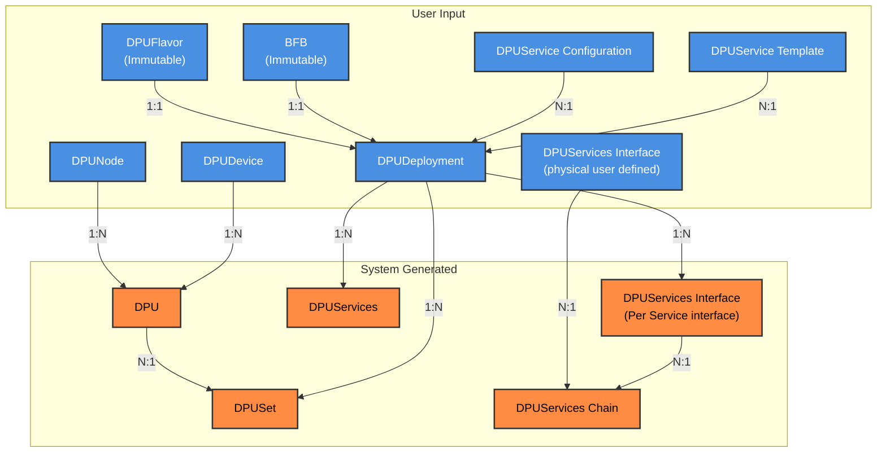
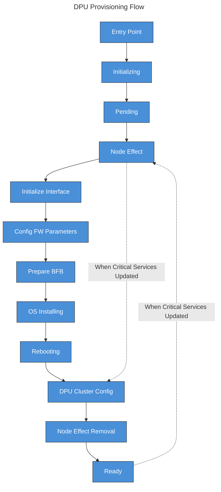

# DPF Carbide SDK \- DPF background

## Overview

### Goal

Provide the carbide team a simple SDK which they can utilize to call DPF API and hide the K8S internals and CRD interactions

### Target version

The SDK is targeted for Carbide initial integration with DPF, referred to as milestone 4 in Carbide integration design document

### Documents

* Carbide design document [Link](https://gitlab-master.nvidia.com/nvmetal/designs/-/blob/fafac89e312a0f4c36f6fcbfa3da2bd7c06e2e46/designs/0101-DPF.md).

## Overview of DPF CRDs

Generally DPF is built in a way where the user provides the desired state of a group of DPUs in the cluster, the desired state includes:

1. The OS and FW file to install on the DPU (released by DOCA) \- BFB CR  
2. How the DPU should be configured so the services on it would be able to function properly (things like NIC FW parameters, OS configuration, OVS configuration etc) \- DPUFlavor CR  
3. Applications (DPUServices) to deploy on each DPU and basic configuration for it \- DPUServiceTemplate  
4. Configuration for the applications, basically parameters to their helm chart \- DPUServiceConfiguration  
5. Meta Object which contains 1-4 and how the network traffic would flow between the required services \- DPUDeployment 

The Infrastructure itself always changes, new servers are added and removed from the data center, and their DPUs as well, for that we have:

- DPUNode \- the name of the server in the bare metal management system (Carbide) and the DPUs it has attached  
- DPUDevice \- A physical DPU in the data center, contain the BMC address basically  
- DPUServiceInterface \- the ​​names of the network interfaces of the DPU, this is usually the same for all DPUs of a given type

See the following for more explanation:

- [DPUDeployment Docs](https://docs.nvidia.com/networking/display/dpf25101/dpudeployment) (best to start with)  
- [DPUService Docs](https://docs.nvidia.com/networking/display/dpf25101/dpuservice)  
- [DPUServiceChain Docs](https://docs.nvidia.com/networking/display/dpf25101/dpuservicechain)  
- [DPUSet Docs](https://docs.nvidia.com/networking/display/dpf25101/dpuset)  
- [API reference](https://docs.nvidia.com/networking/display/dpf25101/api-reference) (contains all status and spec fields)

## 

## DPF Carbide interaction design decisions

Carbide team has made the following decisions on the interaction with DPF:

1. Carbide should be the source of truth for the DPU and initiate any change in the DPU state  
2. Carbide need to actively trigger or “approve” any disruptive operation on the DPU Server, such as DPU Provisioning or Reprovisioning  
3. Carbide shall perform any interactions with the server BMC, including Server reboot and Server ASTRA enablement  
4. Carbide shall perform the site discovery and tell DPF which DPUs exist in the cluster, DPF shouldn’t discover DPUs on its own  
5. Carbide should not receive any API calls from DPF (Carbide calls DPF, DPF shouldn’t call Carbide)  
   For example, if a DPF change to “not ready” for any reason, carbide would notice it through pulling on DPF (or k8s watch), DPF won’t call an API of carbide to “notify” on change 

## 

## Overview of Carbide DPF current use cases/flows 

1. **Initial data hall desired state definition**  
   1. When carbide initially starts it would tell DPF what “groups” of DPUs to be in the site and what is the desired state of each, this is created once on carbide initial installation  
   2. It would basically be a DPUDeployment CR for each “group” and its dependences (DPUFlavor, BFB, DPUServiceTemplate, DPUServiceConfiguration)  
   3. The DPUFlavor, DPUServiceTemplate and DPUServiceConfiguration details would be decided during milestone 4, in current implementation Carbide doesn’t use them  
   4. Current Carbide design decision is to create the DPUDeployment (AND DPUSet in current milestone) with spec.nodeEffect.hold which would mean that carbide handles the node effect externally and indicate to DPF when Node effect has been applied (basically when the DPUNode is ready for the disruptive operation of DPU provisioning)  
   5. After the initial CR creation, there should be basically nothing to do other then seeing the objects was created successfully \- because the DPUDevices haven't been created yet, there was no real change, just definition of desired state  
   6. Verification:  
   7. Examples of DPU Groups that would be required for DS9 (just an example, Carbide team would define):  
      1. Vera rubin compute Nodes \- BF4 DPUs which would run services needed for a GPU node:  
         * Carbide services  
         * E/W VPC  
         * HBN (N/S VPC \+ DHCP)  
         * DTS (Telemetry)  
         * SNAP Client (Storage)  
         * Argus (NIM security)  
      2. Data Hall management nodes \- BF3 DPUs on CPU nodes which would run what is needed for management:  
         * Carbide services  
         * HBN (N/S VPC \+ DHCP)  
         * DTS (Telemetry)  
      3. Storage Nodes \- BF3/4 which would run the Storage target and Management:  
         * Carbide services  
         * HBN (N/S VPC \+ DHCP)  
         * DTS (Telemetry)  
         * SNAP Target (Storage)

2. **DPUDevice \+ DPUNode Discovery:**  
   1. When Carbide Site Explorer discovers a new DPU it created the DPUNode and DPUDevice objects in DPF to notify DPF on the details  
   2. DPF has its own discovery logic which Carbide decided to disable since they are already doing site exploration (which make sense)  
   3. After Objects would be created it would cause DPF to do some basic initialization to the DPUDevice Redfish  
   4. Current Carbide design decision is to create the DPUNode with spec.nodeRebootMethod.external, which means carbide would trigger the reboot and after reboot was externally performed set the [annotation](https://gitlab-master.nvidia.com/doca-platform-foundation/doca-platform-foundation/-/blob/main/docs/public/developer-guides/api/dpunode.md?ref_type=heads#annotations) to false  
   5. Carbide should add labels to the DPUNode and DPUDevice based on the label selectors he would have on its DPUDeployment CRs, the labels should basically be the “groups”  
   6. Verification:  
      1. DPUNode.status.conditions.Ready \== true  
      2. DPUDevice.status.conditions.Ready \== true

      \*\* There are more conditions to indicate if something went wrong, or if the object is stuck in the middle

3. **DPU initial provisioning:**  
   1. After discovery is done a DPUNode and DPUDevice would be created, DPF would automatically create a DPU object for each DPUDevice with the matching labels but won’t start provisioning since each DPU would be created with a spec.nodeeffect.hold field  
   2. When Carbide reaches the state where it is OK to start the DPU provisioning it would release the node effect by editing the DPUNodeMatintence hold annotation to false  
        kubectl \-n dpf-operator-system annotate dpunodemaintenance \<maintenance-name\> provisioning.dpu.nvidia.com/wait-for-external-nodeeffect=false \--overwrite  
   3. After node effect has been set to false, this would indicate to DPF that it can progress with the DPU provisioning and it would start installing OS and configuring the DPU  
   4. When OS installation is done, if Server reboot is required for configuration to take effect, the DPU would wait in phase “Rebooting” till Carbide has rebooted the node (since carbide decided to use noderebootmethod external) and the DPUNode for the DPU object would have condition of DPUNodeRebootInProgress \= WaitForExternalReboot  
   5. After carbide has rebooted the Node it should remove the external reboot required annotation from the DPUNode, indicating to DPF that node reboot was complete  
   6.   kubectl \-n dpf-operator-system annotate dpunode \<dpunode-name\> provisioning.dpu.nvidia.com/dpunode-external-reboot-required-  
   7. When annotation is removed the DPU would gradually progress to Ready state and the DPUServices would start getting deployed on the DPU  
   8. Verification:  
      1. DPU.status.Phase \= Ready  
   9. Basically in Caribde world:  
      1. DPU Provisioning start \== removing the node effect annotation  
      2. Monitor DPU till it gets to phase rebooting or ready  
      3. If DPU got to phase rebooting: reboot server and remove annotation  
      4. If DPU got to phase ready wait till Services condition is set  
      5. After services condition is set we are done  
   10. Notice:  
       1. In BF4 the loop of reboots can occur multiple times \- it would only exist in carbide in \~06.26 and it is not part of current design document

4. **DPU Reprovisioning:**  
   1. Basically just deleting the DPU object that needs to be reprovisioned  
   2. The DPU object would move to phase deleting (this maybe really fast) and a new DPU object would get created (with the same name) and would hang on Node effect  
   3. From that moment the flow is exactly like initial provisioning

5. **DPU state monitoring:**  
   1. After a DPU reaches ready state and the DPU services are deployed Carbide should monitor that the DPU services are all still running and nothing bad has occurred.  
   2. If the DPU has moved to phase NodeEffect, this means services which were marked critical are down and Carbide should immediately remove the node from the pool  
   3. Service might come back up, in which case the DPU would move to state ready, or it may hang in node effect in which a DPU reprovisioning or manual investigation should occur  
   4. The behavior should be decided by the Forge team, currently it is TBD based on design document

6. **DPU Version Upgrades (BFB upgrade):**  
   1. When carbide would want to upgrade a DPU it would change the bfb reference in the DPUDeployment (maybe also the services if they require a specific BFB).   
   2. After that it is the same as reprovisioning, the new DPU would get reprovisioned with the new BFB  
   3. TODO, can a DPUDeployment have DPUServices from Multiple versions while it is updated?

7. **DPU deletion**  
   1. Deleting the DPUDevice Object \- that is true deletion, no DP  
8. **DPU Node deletion**  
9. **DPU Force deletion**  
10. **DPU Node Force deletion**  
11. **Multi DPU initial provisioning/reprovisioning:**  
    1. From DPF POV this is the same as a single DPU provisioning/reprovisioning  
    2. Only change is that node effect and node reboot is shared between the 2 DPUs, but those are operations on the server level  
    3. In Carbide this is a dedicated logic in state machine, not sure if it has any impact

12. DPF System Upgrade:  
    1. TBD

## 

## Suggested Carbide SDK methods

\*\*This is just to get you started\*\*

1. CreateCarbideInitilizationObjects  
2. CreateDPUNode(DPUNodeName string, \[\]DPUDevices)  
3. MarkDPUNodeAsReadyForMatintence(DPUNodeName string)  
4. MarkDPUNodeAsRebooted(DPUNodeName string)  
5. ReprovisionDPU(DPUName string)  
6. IsDPUNodeWaitingForReboot(DPUNodeName string)  
7. IsDPUReady(DPUName string)  
8. UpdateDPUDeploymentBFB(DPUDeploymentName string, BFBName string)  
9. UpdateDPUDeploymentConfiguration(DPUDeploymentName string, DPUFlavorName string)  
10. DeleteDPU(DPUDeviceName string)  
11. ForceDeleteDPU(DPUDeviceName string)  
12. DeleteDPUNode(DPUNodeName string)  
13. ForceDeleteDPUNode(DPUNodeName string)

## 

## DPU State Machine

The DPU Object is a real state machine, it is the only object in DPF which has one, each state has a condition (among others) but you can see the phase through the DPU.status.phase field  
There is also “deletion” phase and “Error” phase which are end states that you can move to from any phase

