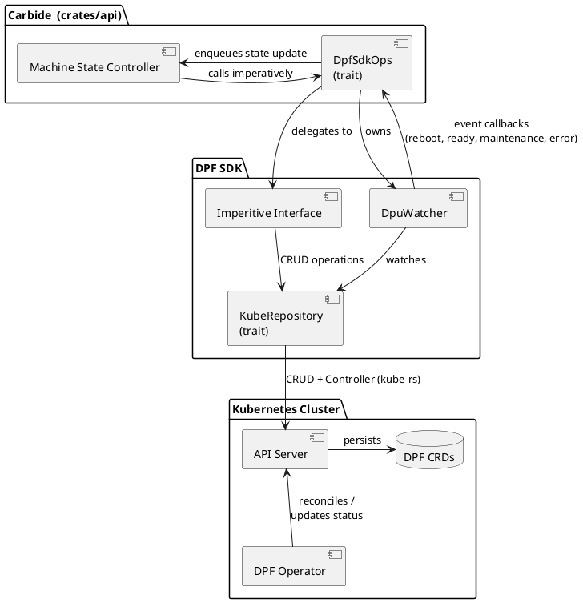
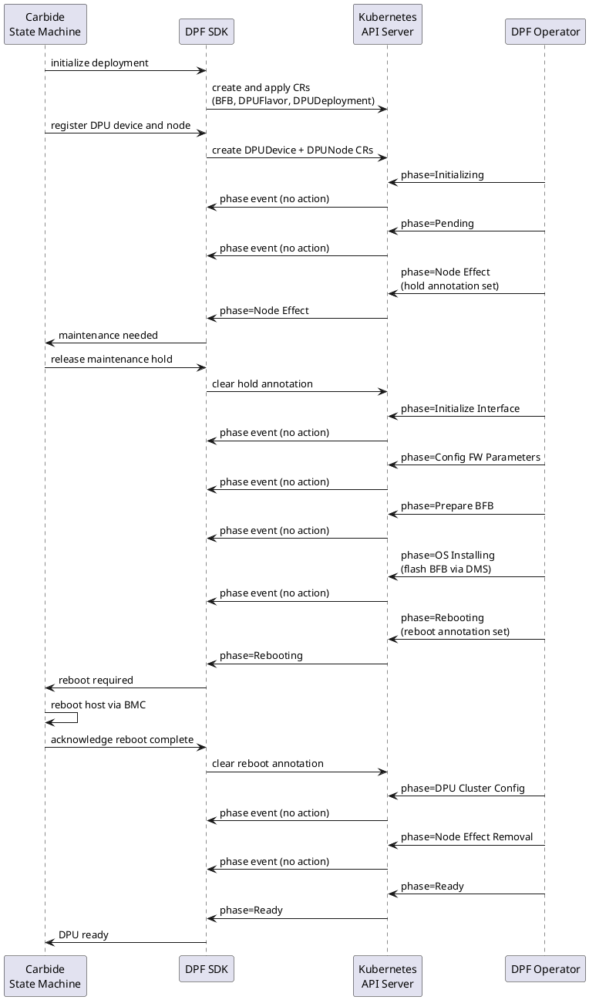

# SDD: DPF Custom Resource SDK

## Software Architecture & Design Document (PLC-L1 SADD v2018-02-07/NGC)

### Revision History

| Version | Date | Modified By | Description |
| :---: | :---: | :---- | :---- |
| 0.1 |  | [James McNamee US](mailto:jmcnamee@nvidia.com) |  |
| 0.2 |  | [Frank Spitulski US](mailto:fspitulski@nvidia.com) |  |
### Stakeholder Approvals

| Stakeholder Name | Role\* | Date | Approver Comments & Version Approved |
| :---- | :---: | :---: | :---- |
|  |  |  |  |

\*Stakeholder role is for this SRD. Options: pic, prod(uct), arch(itecture), eng(ineering), qa, cust(omer).

# 1 Introduction

## 1.1 Overview

Carbide will use an SDK (written in Rust) to act as a translation layer between itself and the DOCA Platform Framework (DPF) Operator. Carbide will not directly produce and submit DPF Custom Resources to the Kubernetes api server, rather, an SDK will be embedded within Carbide to perform the Kubernetes actions on its behalf.

The SDK is intended to provide a library of methods that Carbide can imperatively call to manage the DPU fleet. These methods will encapsulate the functionality that would otherwise be achieved by submitting DPF Custom Resources directly, but Carbide is unaware of the underlying mechanism.

In practical terms the SDK reuses much of the existing DPF integration, refactoring and encapsulating DPF CR handling while also adding new features.

The SDK API should cover the use-cases as defined in the [DPF Carbide Integration SRD](https://docs.google.com/document/d/1OPLJGxTfgVHgz0TrLiaj3Z8q0jt29I7r-ioVUPzFZww/edit?tab=t.0).

## 1.2 Assumptions, Constraints, Dependencies

* DPF Operator and Carbide are deployed to the same Kubernetes cluster  
* The SDK does not provision any Kubernetes resources other than the CRDs defined by DPF (and direct dependencies thereof, for example ConfigMaps if required)  
* The SDK does not provision DPUs directly  
* The SDK does not deploy, operate, or maintain the DPF Operator

## 1.3 Definitions, Acronyms, Abbreviations

| Term | Definition |
| :---- | :---- |
|  |  |

## 1.4 Reference Documents

| Document  |
| :---- |
| [SRD: DPF Custom Resource SDK](https://docs.google.com/document/d/1odpX8eQyUf6m8M4EMq7BjoANDswtJiclWDTsGqW6lsE/edit?tab=t.0) |
| [DPF Carbide Integration SRD](https://docs.google.com/document/d/1OPLJGxTfgVHgz0TrLiaj3Z8q0jt29I7r-ioVUPzFZww/edit?tab=t.0) |

# 2 Architecture Details

## 2.1 Overview

Three layers collaborate to provision DPUs:

1. **Carbide** (`crates/api`) - drives provisioning imperatively through a state machine and reacts to DPU lifecycle events via watcher callbacks.
2. **DPF SDK** (`crates/dpf`) - translates high-level operations into DPF CRD manipulations and surfaces DPU lifecycle events back to Carbide.
3. **Kubernetes** - persists DPF CRDs; the DPF Operator reconciles them against physical DPU hardware.

## 2.2 Provisioning Flow

Carbide drives provisioning imperatively and the DPF Operator drives the DPU lifecycle asynchronously. The SDK bridges the two: Carbide calls SDK operations to declare intent via CRDs, and the watcher delivers operator-driven events back as typed callbacks that re-trigger the state machine.

This pattern is key for the integration of DPF with Carbide. DPF does not drive Carbide's state machine. It indicates that a given machine is ready for some action by Carbide. Similarly Carbide does not attempt to understand DPF or control the DPU beyond what is needed for graceful provisioning. Carbide declares up-front what should be deployed on the DPU and lets DPF handle it (via the SDK API).

The sequence below covers the first-time provisioning path:

# 3 Design Details

## 3.1 SDK Components

### 3.1.1 DpfSdk

`DpfSdk<R, L>` is the main SDK struct, generic over a `DpfRepository` implementation `R` and a `ResourceLabeler` `L`. Trait bounds are placed on individual `impl` blocks rather than the struct declaration, allowing tests to instantiate `DpfSdk` with a partial mock covering only the traits exercised by the methods under test.

| Method | Purpose |
| :---- | :---- |
| `create_initialization_objects` | Creates BFB, DPUFlavor, DPUServiceTemplate, DPUServiceConfiguration, and DPUDeployment CRs |
| `register_dpu_device` | Creates a DPUDevice CR for manual DPU discovery |
| `register_dpu_node` | Creates a DPUNode CR for manual host discovery |
| `release_maintenance_hold` | Removes the `wait-for-external-nodeeffect` annotation from a DPUNode |
| `reboot_complete` | Removes the `dpunode-external-reboot-required` annotation after Carbide reboots the host |
| `reprovision_dpu` | Deletes the DPU CR so the operator recreates it |
| `force_delete_host` | Removes all DPF CRs for a host (DPU, DPUDevice, DPUNode) |
| `update_deployment_bfb` | Patches the BFB reference in a DPUDeployment for BFB upgrades |
| `get_dpu_phase` | Reads the current DPU CR phase |

### 3.1.2 DpuWatcher

`DpuWatcherBuilder` constructs a `DpuWatcher` that runs a Kubernetes controller loop over DPU CRs via `kube-rs`. Raw resource watch events are translated into typed callbacks registered on the builder:

| Callback | Trigger condition |
| :---- | :---- |
| `on_dpu_event` | Any DPU CR update |
| `on_maintenance_needed` | DPU enters NodeEffect phase and the hold annotation is present |
| `on_reboot_required` | DPUNode carries the `dpunode-external-reboot-required` annotation |
| `on_dpu_ready` | DPU CR phase transitions to Ready |
| `on_error` | DPU CR phase transitions to Error |

The `DPUWatcher` is both unaware of how `carbide` is using the callbacks and of what is producing the DPU events. It is solely focused on consuming DPU events and invoking callbacks when needed. (Carbide's) callbacks are allowed to fail so, callbacks must be idempotent to account for retries. Failed callbacks are retried with wait and jitter until a new CR state occurs. The latest CR state is always sent in callbacks. Deleted CRs are removed without event, following the idempotent k8s controller pattern.

### 3.1.3 DpfRepository / KubeRepository

`DpfRepository` is a supertrait combining per-resource repository traits (`BfbRepository`, `DpuRepository`, `DpuDeviceRepository`, `DpuNodeRepository`, `DpuNodeMaintenanceRepository`, `DpuFlavorRepository`, `DpuDeploymentRepository`, `DpuServiceTemplateRepository`, `DpuServiceConfigurationRepository`, and `K8sConfigRepository`). Each sub-trait provides typed CRUD operations for one CRD kind.

`KubeRepository` is the production implementation. It holds a `kube::Client` and maps each repository method to a `kube::Api` call. The trait boundary enables per-resource mock substitution in tests without requiring a real cluster.

The watch method uses `kube::runtime::Controller` to provide retry and requeue behaviour on handler errors. The controller internally handles k8s state desync by periodically relisting. Note this is not our pattern or design. This is how `kube-rs` and other k8s controllers handle it.

### 3.1.4 CRD Types

Rust struct bindings for all DPF operator CRDs are generated from the upstream NVIDIA doca-platform CRD YAML using `kopium`, one file per CRD kind under `crates/dpf/src/crds/`. `kopium` will soon release `build.rs` support meaning we will not have to commit generated code.

## 3.2 Carbide Integration

### 3.2.1 DpfOperations Interface

`DpfOperations` is a trait in carbide to allow for a well defined API and swappable SDK implementation. It is annotated with `mockall::automock` to allow test substitution without Kubernetes machinery.

`DpfSdkOps` is the production implementation. It wraps `DpfSdk<KubeRepository, CarbideDPFLabeler>` and owns the `DpuWatcher`, keeping the watch loop alive for the process lifetime.

### 3.2.2 Resource Labeling

`CarbideDPFLabeler` implements `ResourceLabeler` to attach Carbide-specific labels to DPUDevice and DPUNode resources on creation:

| Label | Applied to |
| :---- | :---- |
| `carbide.nvidia.com/controlled.device=true` | DPUDevice |
| `carbide.nvidia.com/host-bmc-ip=<ip>` | DPUDevice |
| `carbide.nvidia.com/controlled.node=true` | DPUNode |

The node label is also used as the `dpu_node_selector` in DPUDeployment and is removed when the node is deleted.

### 3.2.3 Event Dispatch

When the watcher fires a callback, `DpfSdkOps` resolves the affected host and enqueues it into Carbide's state controller:

1. Parse `dpu-node-{machine_id}` to extract the Carbide machine UUID.
2. Look up the host record in the database.
3. Enqueue the machine into the state controller work queue.

The state controller then calls `DpfOperations` methods imperatively to query the SDK and perform only the needed actions requested by the DPF Operator. A `DpfProvisioning` health alert override is applied while DPF performs disruptive operations, preventing new allocations on the host.

An important note: These events indicate intent from the SDK and allow for instant reaction rather than relying on polling. This does *not* prevent Carbide from running its state machine at any time. Carbide's periodic enqueuer may continue to idempotently drive forward the DPU maintenance and reboots as needed by querying the SDK. Despite the SDK's Watcher API promising to requeue and reconcile all DPU changes, even if that were to fail Carbide's own periodic enqueuer will eventually drive the DPU forward. That means event dispatch is optional but *heavily* recommended due to the faster DPU provisioning it allows.

### 3.2.4 Naming Conventions

The host resolution is completely open to debate. This method simply works for now. Labels or other conventions are fine.

Resource names follow DPF operator conventions enforced by SDK helper functions:

| Helper | Format | Example |
| :---- | :---- | :---- |
| `dpu_node_name(node_id)` | `dpu-node-{node_id}` | `dpu-node-550e8400-...` |
| `dpu_name(device, node_id)` | `dpu-node-{node_id}-{device}` | `dpu-node-550e8400-...-bf0` |
| `node_id_from_node_name(name)` | strips `dpu-node-` prefix | `550e8400-...` |

`node_id` is the Carbide machine UUID.

### 3.2.5 DPU Debugging

While a DPU is in `WaitingForReady`, Carbide tracks the current DPF phase as an optional string and persists it in the machine DPF substate. The phase comes from the SDK's `get_dpu_phase`, which reads the DPU CR status and maps operator phases to a `DpuPhase` enum (e.g. `Provisioning("Initializing")`, `Provisioning("OsInstalling")`, `Provisioning("etc...")`, `NodeEffect`, `Rebooting`, `Ready`, `Error`, `Deleting`). Carbide updates this phase only when it changes and uses it for observability and debugging. Operators can see which phase a DPU is in without querying Kubernetes or the DPF operator directly. This is purposely a string rather than an enum to encourage Carbide's use of only actionable states within the Carbide state machine.
